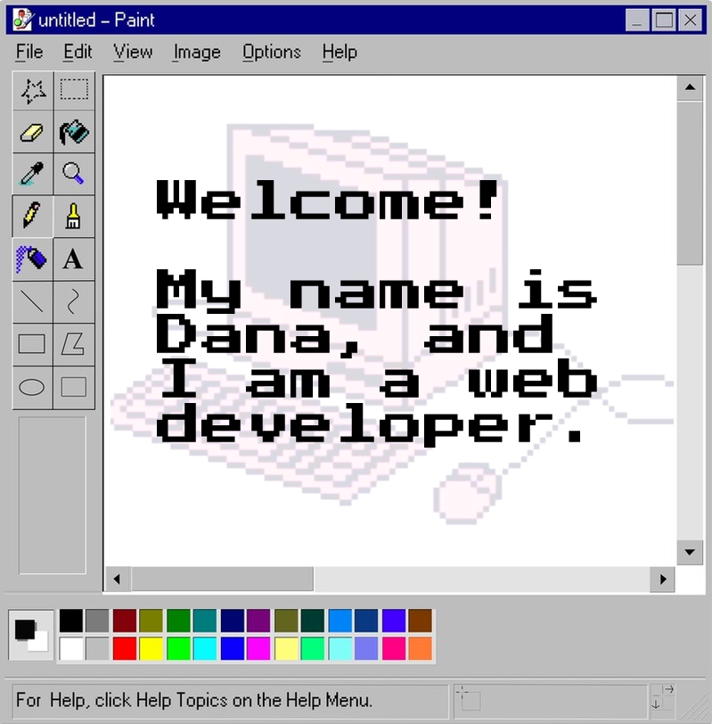

<h1 align="center">Dana Xenia Marasca—@dxenia</h1>
Nice to see you here, and welcome to my GitHub profile!  My name is <b>Dana</b> and I love coding.  

## About Me
📍  Born and raised in Italy, now based in Malmö, Sweden.  
🤖  Passionate about generative art in coding.  
👩🏼‍💻  Focus on JavaScript and its related technologies.  
💖  Attentive to details with a beginner's mindset. Curiosity as the top priority, always!  
🐾  Fun fact: ACNH is my favorite video game. 

## My Current Tech Stack

Along with improving my current skills, I am in the process of self-teaching:

## Get in touch!
I am always open for collaborations, feedbacks, learning and working opportunities. 
- LinkedIn: https://www.linkedin.com/in/dana-xenia-marasca/
- email: marascadanaxenia@gmail.com